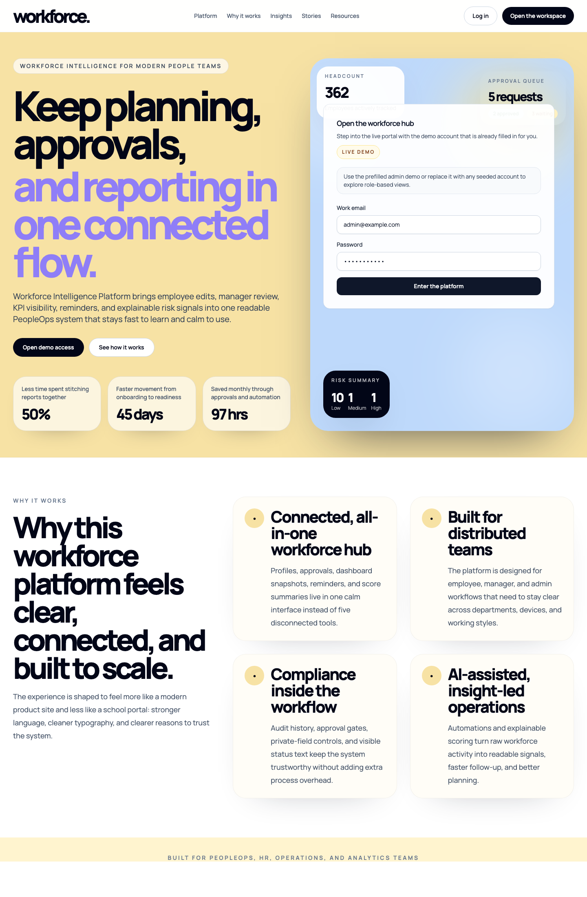
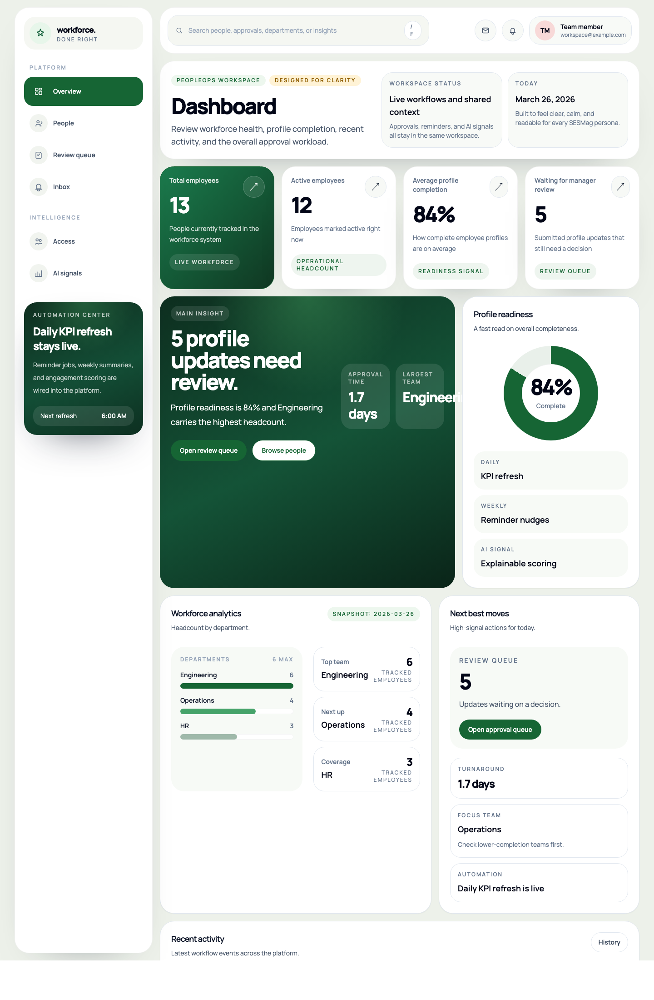
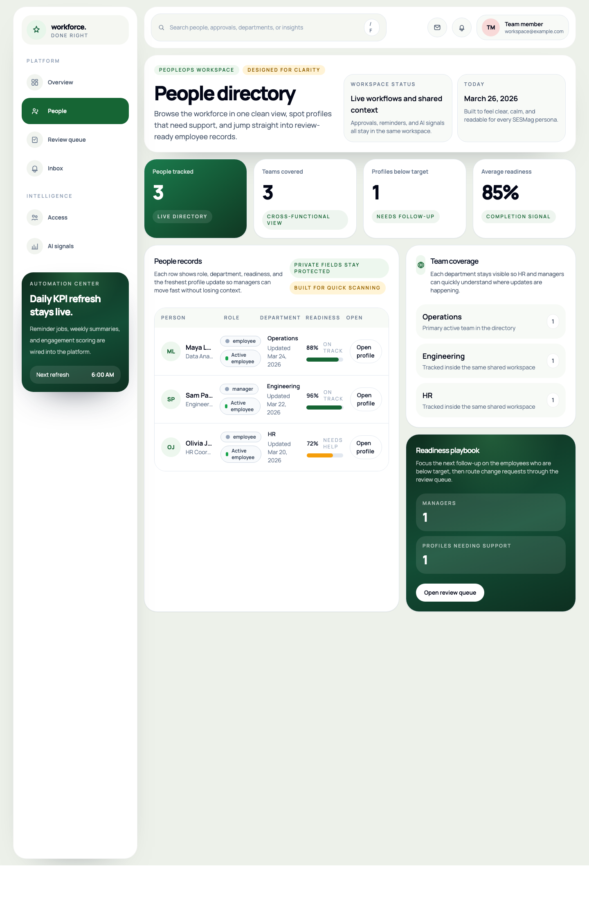
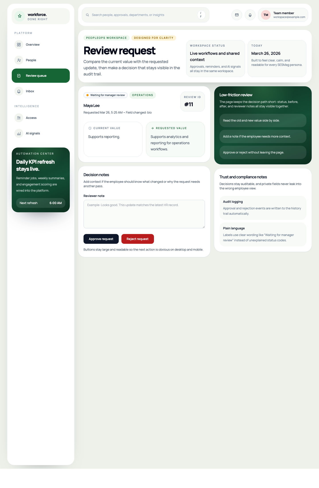
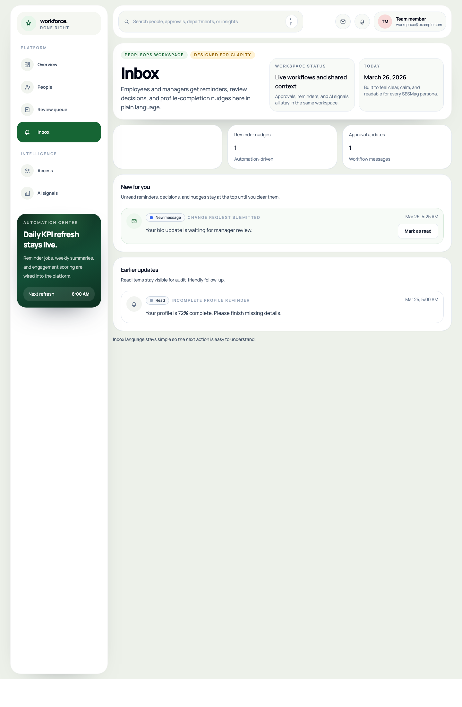
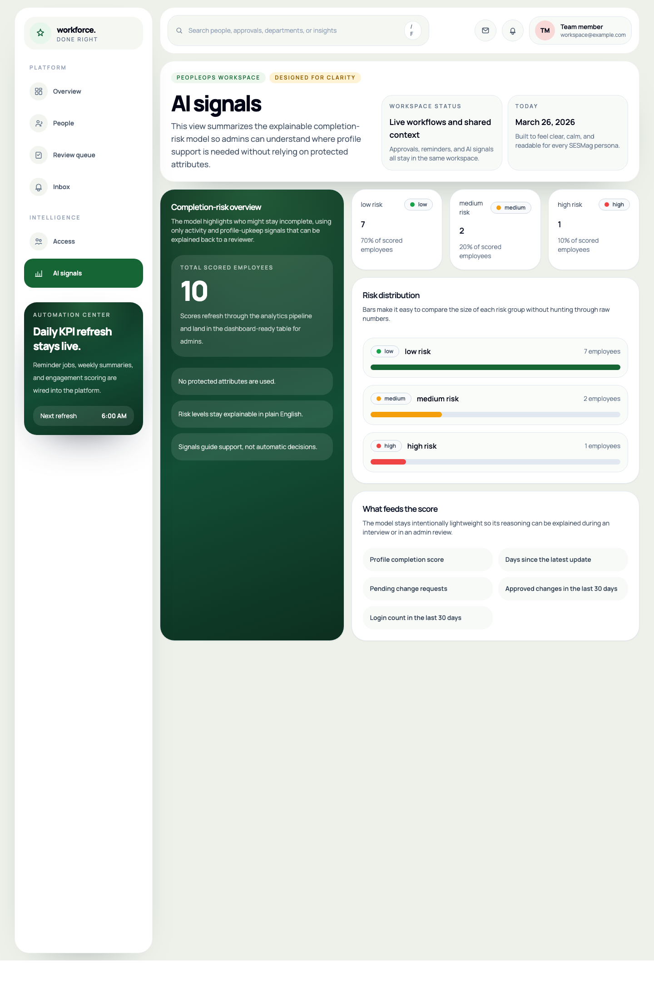
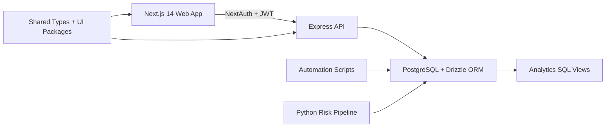

# Workforce Intelligence Platform

Workforce Intelligence Platform is a recruiter-ready full-stack PeopleOps application that combines HR self-service, manager approvals, analytics dashboards, automation workflows, and an explainable machine-learning risk score in one monorepo.

It was designed to show both product judgment and engineering depth:

- full-stack product delivery with `Next.js 14`, `Express`, `PostgreSQL`, and `Drizzle`
- analytics engineering with reporting views, KPI refresh jobs, and snapshot tables
- applied data science with a Python completion-risk pipeline and explainable scores
- human-centered UX for different technology comfort levels, with SESMag and DAV-aware decisions throughout

## Demo

- Frontend: deployment-ready, Vercel configuration documented in [Deployment Guide](./docs/deployment.md)
- API: deployment-ready, Railway and Render configuration documented in [Deployment Guide](./docs/deployment.md)
- Demo accounts:
  - `admin@example.com` / `password123`
  - `olivia.james@example.com` / `password123`

## Why It Stands Out

- Employees cannot directly overwrite profile data; every edit becomes a tracked approval request.
- Managers and admins get KPI visibility, recent activity, notifications, and explainable workforce health indicators.
- Analytics and ML are integrated into the operational product instead of being separate notebooks or dashboards.
- The UX uses plain language, visible labels, strong hierarchy, and accessible status indicators for lower-friction use.

## Screenshots

| Landing page | Dashboard |
| --- | --- |
|  |  |

| Employee directory | Approval review |
| --- | --- |
|  |  |

| Notifications | Risk score analytics |
| --- | --- |
|  |  |

## Core Features

- Role-based authentication with `employee`, `manager`, and `admin` access levels
- Employee profile workspace with public and private field separation
- Approval workflow where profile edits become change requests before data changes are applied
- Audit logging for every write action
- Manager/admin KPI dashboard with activity, department health, and workforce readiness views
- Notification center for reminders, approvals, and workflow updates
- SQL reporting views and daily KPI snapshots
- Python-based completion-risk scoring with plain-English explanations

## Architecture



More detail lives in [Architecture](./docs/architecture.md).

## Tech Stack

| Area | Tools |
| --- | --- |
| Frontend | Next.js 14 App Router, TypeScript, Tailwind CSS, NextAuth |
| Backend | Node.js, Express, TypeScript, Zod |
| Database | PostgreSQL, Drizzle ORM |
| Shared packages | Turborepo, `packages/shared`, `packages/ui`, `packages/db` |
| Analytics | SQL reporting views, KPI snapshots, reminder and summary scripts |
| Data science | Python, pandas, scikit-learn, Logistic Regression / Random Forest |
| Testing | Vitest, React Testing Library, Supertest |
| DevOps | Docker Compose, Dockerfiles, GitHub, deployment guides for Vercel + Railway/Render |

## Repository Structure

```text
workforce-intelligence-platform/
├── apps/
│   ├── api/          # Express API
│   └── web/          # Next.js product app
├── packages/
│   ├── db/           # Drizzle schema, migrations, helpers
│   ├── shared/       # Shared types and zod contracts
│   └── ui/           # Shared UI components
├── analytics/
│   ├── sql/          # Reporting views
│   └── python/       # Feature engineering, training, scoring
├── scripts/          # Seeds, KPI refresh, reminders, summaries
├── docs/             # Architecture, setup, DAV UX, deployment, submission
└── submission_assets/ # Screenshots and submission PDF
```

## Local Setup

1. Copy `.env.example` to `.env`
2. Install dependencies:

   ```bash
   npm install
   ```

3. Start PostgreSQL:

   ```bash
   docker compose up postgres -d
   ```

4. Run migrations and seed data:

   ```bash
   npm run db:migrate
   npm run db:seed
   ```

5. Start the web and API apps:

   ```bash
   npm run dev
   ```

## Environment Variables

- `DATABASE_URL`
- `PORT` or `API_PORT`
- `JWT_SECRET`
- `NEXTAUTH_SECRET`
- `NEXTAUTH_URL`
- `NEXT_PUBLIC_API_URL`
- `API_INTERNAL_URL`
- `WEB_APP_URL`

## Useful Commands

```bash
npm run dev
npm run typecheck
npm run test
npm run db:migrate
npm run db:seed
npm run kpis:refresh
npm run notify:remind
npm run summary:weekly
```

## Data Science Pipeline

The DS layer predicts which employees are at risk of staying profile-incomplete using five non-protected signals:

- completion score
- days since last update
- pending change request count
- approved changes in the last 30 days
- login count in the last 30 days

Run it from `analytics/python`:

```bash
python3 -m venv .venv
source .venv/bin/activate
pip install -r requirements.txt
make pipeline
```

Scored results are written back to `engagement_scores` with:

- `score`
- `risk_level`
- `explanation`

## Accessibility And DAV UX

This project was intentionally designed for lower-friction interaction:

- visible labels instead of placeholder-only inputs
- text plus icon for status, not color alone
- large touch targets and visible focus states
- mobile-first responsive layouts
- plain-language messages like “Waiting for manager review”
- clear separation of public vs private employee data

## Deployment

Deployment guidance and environment mappings are documented in:

- [Deployment Guide](./docs/deployment.md)
- [Setup](./docs/setup.md)

## Documentation

- [Architecture](./docs/architecture.md)
- [DAV UX](./docs/DAV-ux.md)
- [Deployment](./docs/deployment.md)
- [Career Assets](./docs/career-assets.md)
- [SESMag Writeup](./docs/SESMag-writeup.md)
- [Submission Notes](./docs/submission.md)
